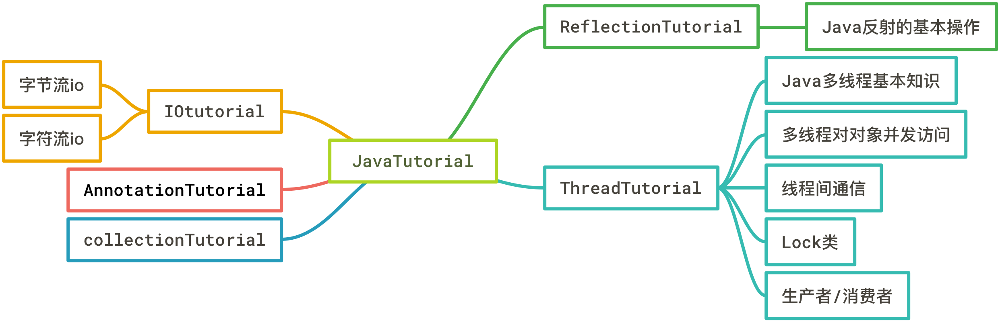

# JavaTutorial内容说明
该Java教程是学习Java过程中对Java知识点进行梳理。每一个包中的代码都有一个ReadMe来说明该包代码的作用以及知识点。

## ThreadTutorial内容说明
在源码路径下`cn.byhieg.threadtutorial`中放置的是Java多线程的代码和测试例子，在每一个章的包下，都有一个ReadMe来说明该章的知识点。
在char01包里放置Java多线程基本知识的代码。内容如下：

1. 如何使用多线程
2. 如何得到多线程的一些信息
3. 如何停止线程
4. 如何暂停线程
5. 线程的一些其他用法

在char02包里放置了Java对变量和对象并发访问的知识的代码。内容如下：

1. 对于方法的同步处理
2. 对于语句块的同步处理
3. 对类加锁的同步处理
4. 保证可见性的关键字——volatile

